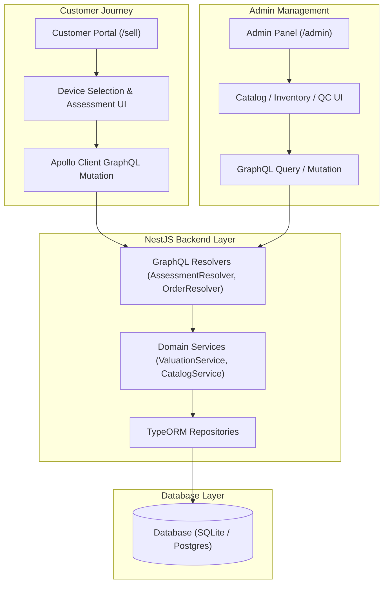
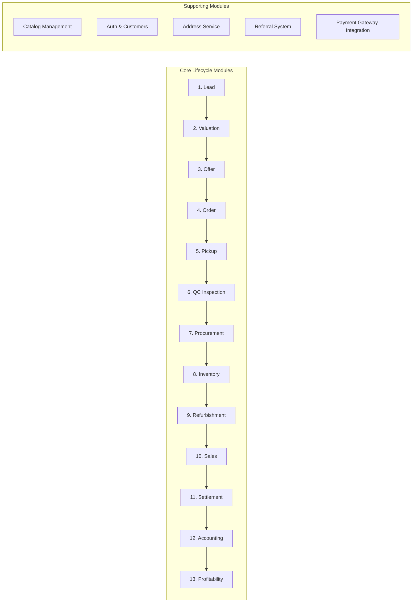

# BIZROK PROJECT WORKFLOW INTELLIGENCE

> **Source of Truth System**: Code-driven architectural mapping automatically generated from repository source code.
> **Last Generated**: 2026-07-29T18:49:39.977Z

---

## Executive Summary & Architecture Overview

Bizrok is an enterprise monorepo platform designed for device trade-in lifecycle management (lead capture, valuation, quality control, procurement, inventory, refurbishment, sales, settlement, and accounting).

### Applications & Key Boundaries

| Layer | Workspace Path | Technology Stack | Purpose |
| --- | --- | --- | --- |
| **Backend** | `apps/backend` | NestJS 11, TypeORM, GraphQL (Apollo), SQLite/Postgres | Micro-monolith backend providing 18 domain modules |
| **Admin Panel** | `apps/frontend` | Next.js 16 (App Router), Tailwind CSS v4, Zustand | Administrative control center for catalog, inventory, pricing & QC |
| **Customer Website** | `apps/customer-website` | Next.js 16 (App Router), Tailwind CSS v4, Apollo Client | Customer-facing trade-in portal & valuation journey |
| **Shared Package** | `packages/shared` | TypeScript, Class Validator | Monorepo-wide DTOs, enums (`EventNames`), and type definitions |

---

## End-to-End Execution Flow

---

## Monorepo Domain Module Map

The backend consists of 18 domain modules registered in `app.module.ts`:

---

## Detailed Generated Documentation Reports

- 📘 [Frontend Customer Workflow](file:///E:/bizrok.in/workflow/generated/frontend-workflow.md)
- 🖥️ [Admin Panel Workflow](file:///E:/bizrok.in/workflow/generated/admin-workflow.md)
- ⚙️ [Backend Architecture Map](file:///E:/bizrok.in/workflow/generated/backend-workflow.md)
- 🗄️ [Database Entity & Table Map](file:///E:/bizrok.in/workflow/generated/database-map.md)
- 🔌 [GraphQL & REST API Catalog](file:///E:/bizrok.in/workflow/generated/api-map.md)
- 🔗 [End-to-End Dependency Map](file:///E:/bizrok.in/workflow/generated/dependency-map.md)
- ⚠️ [Architectural Issues Report](file:///E:/bizrok.in/workflow/generated/issues.md)

