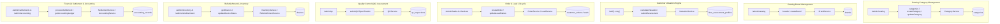

# END-TO-END DEPENDENCY MAP

```mermaid
flowchart TD
    subgraph Chain_0["Catalog Category Management"]
        UI_0["/admin/catalog"] --> GQL_0["categories / createCategory / updateCategory"]
        GQL_0 --> Svc_0["CategoryService"]
        Svc_0 --> DB_0[("categories")]
    end
    subgraph Chain_1["Catalog Brand Management"]
        UI_1["/admin/catalog"] --> GQL_1["brands / createBrand"]
        GQL_1 --> Svc_1["BrandService"]
        Svc_1 --> DB_1[("brands")]
    end
    subgraph Chain_2["Customer Valuation Engine"]
        UI_2["/sell/[...slug]"] --> GQL_2["calculateValuation / submitAssessment"]
        GQL_2 --> Svc_2["ValuationService"]
        Svc_2 --> DB_2[("flow_assessment_profiles")]
    end
    subgraph Chain_3["Order & Lead Lifecycle"]
        UI_3["/admin/leads & /checkout"] --> GQL_3["createOrder / updateLeadStatus"]
        GQL_3 --> Svc_3["OrderService / LeadService"]
        Svc_3 --> DB_3[("customer_orders / leads")]
    end
    subgraph Chain_4["Quality Control (QC) Assessment"]
        UI_4["/admin/qc"] --> GQL_4["submitQCSpecification"]
        GQL_4 --> Svc_4["QCService"]
        Svc_4 --> DB_4[("qc_inspections")]
    end
    subgraph Chain_5["Refurbishment & Inventory"]
        UI_5["/admin/inventory & /admin/refurbishment"] --> GQL_5["getDevices / updateDeviceStatus"]
        GQL_5 --> Svc_5["InventoryService / RefurbishmentService"]
        Svc_5 --> DB_5[("devices")]
    end
    subgraph Chain_6["Financial Settlement & Accounting"]
        UI_6["/admin/settlements & /admin/accounting"] --> GQL_6["processSettlement / getAccountingLedger"]
        GQL_6 --> Svc_6["SettlementService / AccountingService"]
        Svc_6 --> DB_6[("accounting_records")]
    end
```
